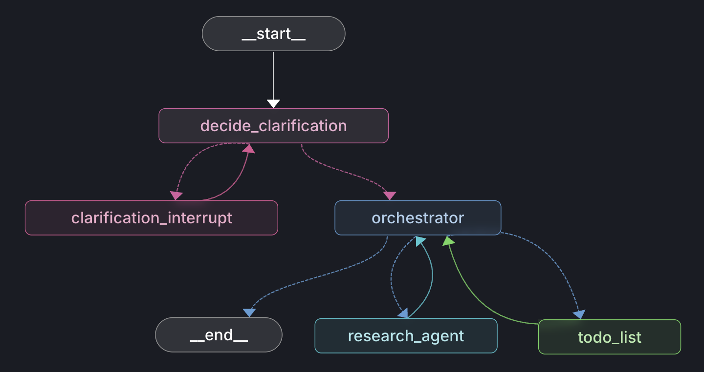
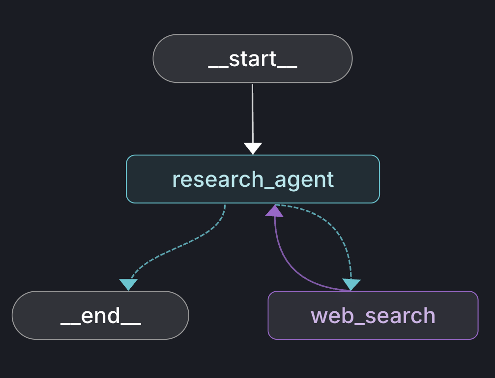

# Simple Deep Research

This repository contains a simplified implementation of a deep research agent built via LangGraph. It is able to take in user queries, clarify scope, and search the web for information to synthesize into a comprehensive report.

## How It Works

The Simple Deep Research agent is built on the core principles of deep agents like Claude Code, Codex, and Cursor while integrating the user experience of popular deep research implementations like ChatGPT's. The system is composed of two LangGraph graphs:

**Main Graph** - Orchestrates the full research lifecycle:
1. **Clarify** - Asks the user clarifying questions via `interrupt`, resumes when answered
2. **Plan** - Orchestrator uses a todo list tool to outline research steps
3. **Delegate** - Kicks off research sub-agents in parallel via tool calls
4. **Synthesize** - Combines sub-agent findings into a final cited report

**Research Graph** - ReAct-style sub-graph for web research:
1. Decides what to search, calls [Tavily](https://www.tavily.com/) web search
2. Filters results by relevance, iterates until sufficient
3. Returns a cited intermediate report to the orchestrator

These work together 

## Installation

1. Clone the repository:

```bash
git clone https://github.com/ALucek/simple-deep-research
cd simple-deep-research
```

2. Install depencies:

```bash
uv sync
```

3. Create a .env file with the following variables:

```env
OPENAI_API_KEY=
TAVILY_API_KEY=
LANGSMITH_API_KEY=
LANGSMITH_TRACING=true
LANGSMITH_ENDPOINT=https://api.smith.langchain.com
LANGSMITH_PROJECT="simple-deep-research"
```

The Simple Deep Research agent connects to the web via [Tavily](https://www.tavily.com/). Tavily generously provides 1,000 free API credits per month, usage and API keys can be created in the [overview page](https://app.tavily.com/home).

[LangSmith](https://smith.langchain.com/) is used for tracing and the Studio IDE. This implementation integrates directly with LangSmith, it is reccomended to interact and view the agent graphs via LangSmith Studio.

## Using LangSmith Studio

To initiate the Simple Deep Research agent in LangSmith Studio, launch the local langgraph server via the command:

```
uv run langgraph dev
```

This will automatically open a window in your browser to the studio IDE. Within the IDE there are two graphs viewable, the `main_graph`:



This contains the core flow and logic for the Simple Deep Research agent. In the top menu you can also choose the `research_graph`:



This contains the research sub agent graph responsible for searching the web.

## Using Locally

The Simple Deep Research graphs can be used directly for custom integrations. When using directly, it is important to respect [checkpointing](https://docs.langchain.com/oss/python/langgraph/persistence) and thread handling as we rely on [interrupts](https://docs.langchain.com/oss/python/langgraph/interrupts) for human-in-the-loop clarification of research scope.

A simplified example of how this can be implemented is provided in [examples/run_agent.py](examples/run_agent.py). Run via

```
uv run examples/run_agent.py
```

