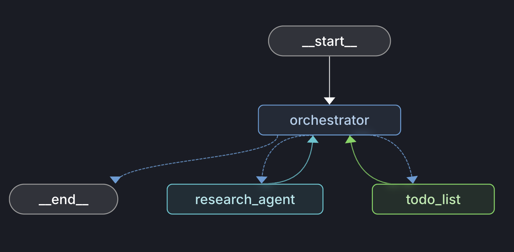
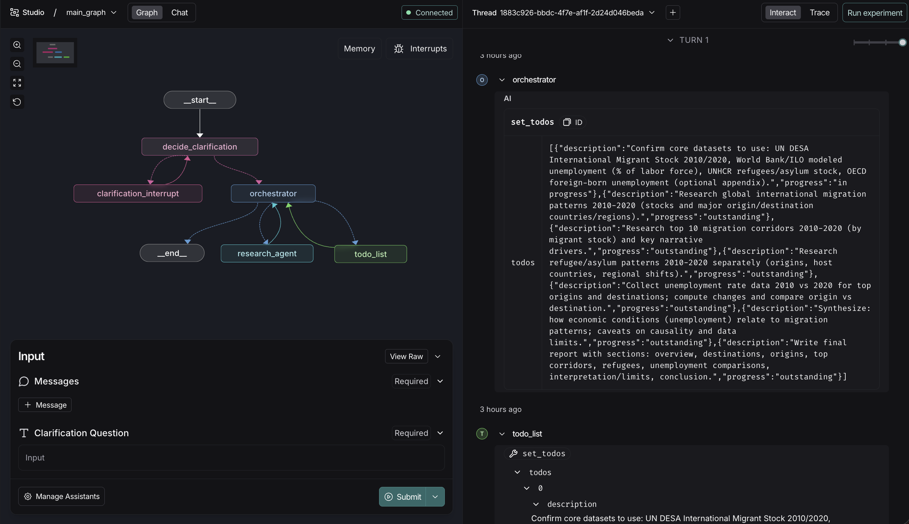

# Simple Deep Research

This repository contains a simplified implementation of a deep research agent built via LangGraph. It is able to take in user queries, clarify scope, and search the web for information to synthesize into a comprehensive report.

## How It Works

The Simple Deep Research agent is built on the core principles of deep agents like Claude Code, Codex, and Cursor while integrating the user experience of popular deep research implementations like ChatGPT's. The system is composed of three LangGraph graphs arranged in a nested architecture:

**Main Graph** - Top-level entry point handling the clarification loop:
1. **Clarify** - Asks the user clarifying questions via `interrupt`, resumes when answered
2. **Orchestrate** - Once clarification is complete, hands off to the orchestrator subgraph

**Orchestrator Graph** - ReACT-style subgraph for delegating research agents and writing the final report:
1. **Plan** - Uses a todo list tool to outline research steps
2. **Delegate** - Kicks off research sub-agents in parallel via tool calls
3. **Synthesize** - Combines sub-agent findings into a final cited report

**Research Graph** - ReAct-style sub-graph for web research:
1. Decides what to search, calls [Tavily](https://www.tavily.com/) web search
2. Filters results by relevance, iterates until sufficient
3. Returns a cited intermediate report to the orchestrator

These work together to create a well cited and structured report in markdown format, an example output can be [viewed here](/examples/report.md)

## Installation

1. Clone the repository:

```bash
git clone https://github.com/ALucek/simple-deep-research
cd simple-deep-research
```

2. Install dependencies:

```bash
uv sync
```

3. Create a .env file with the following variables:

```env
OPENAI_API_KEY=
TAVILY_API_KEY=
LANGSMITH_API_KEY=
LANGSMITH_TRACING=true
LANGSMITH_ENDPOINT=https://api.smith.langchain.com
LANGSMITH_PROJECT="simple-deep-research"
```

The Simple Deep Research agent connects to the web via [Tavily](https://www.tavily.com/). Tavily generously provides 1,000 free API credits per month, usage and API keys can be created in the [overview page](https://app.tavily.com/home).

[LangSmith](https://smith.langchain.com/) is used for tracing and the Studio IDE. This implementation integrates directly with LangSmith, it is recommended to interact and view the agent graphs via LangSmith Studio.

## Using Locally

The Simple Deep Research graphs can be used directly for custom integrations. When using directly, it is important to respect [checkpointing](https://docs.langchain.com/oss/python/langgraph/persistence) and thread handling as we rely on [interrupts](https://docs.langchain.com/oss/python/langgraph/interrupts) for human-in-the-loop clarification of research scope.

A simplified example of how this can be implemented is provided in [examples/run_agent.py](examples/run_agent.py). Run via

```
uv run examples/run_agent.py
```

The orchestrator and researcher subgraph can also be used independently. For example with the orchestrator:

```python
import asyncio
import uuid

from langchain_core.messages import HumanMessage
from langgraph.checkpoint.memory import InMemorySaver

from src.graphs.orchestrator_graph import builder as orchestrator_builder

graph = orchestrator_builder.compile(checkpointer=InMemorySaver()).with_config(
    recursion_limit=1000
)
config = {"configurable": {"thread_id": str(uuid.uuid4())}}

result = asyncio.run(
    graph.ainvoke(
        {
            "messages": [
                HumanMessage(
                    content=(
                        "Research current trends in edge AI for industrial robotics."
                    )
                )
            ]
        },
        config,
    )
)

print(result["messages"][-1].content)
```

And with the research sub-agent:

```python
import asyncio
import uuid

from langchain_core.messages import HumanMessage
from langgraph.checkpoint.memory import InMemorySaver

from src.graphs.research_graph import builder as research_builder

graph = research_builder.compile(checkpointer=InMemorySaver()).with_config(
    recursion_limit=1000
)
config = {"configurable": {"thread_id": str(uuid.uuid4())}}

result = asyncio.run(
    graph.ainvoke(
        {
            "messages": [
                HumanMessage(
                    content="Research top trends in edge AI."
                )
            ]
        },
        config,
    )
)

print(result["messages"][-1].content)
```

## Configuration

Model and search settings are passed through LangGraph's `configurable` dict. Each role (orchestrator, clarifier, researcher) inherits from a shared `default` and can be overridden individually. Any valid [ChatOpenAI](https://python.langchain.com/docs/integrations/chat/openai/) parameter can be passed.

### Structure

```json
{
  "configurable": {
    "thread_id": "...",
    "default": {
      "model": "gpt-5.2-2025-12-11",
      "temperature": 1
    },
    "orchestrator": {},
    "clarifier": {},
    "researcher": {},
    "max_searches": 30
  }
}
```

- **`default`** — Base settings applied to all roles. Must include at least a `model`. Accepts any valid [ChatOpenAI](https://reference.langchain.com/python/langchain-openai/chat_models/base/ChatOpenAI) parameter (`model`, `temperature`, `max_tokens`, `top_p`, `base_url`, etc.).
- **`orchestrator`** — Overrides for the orchestration agent that plans and synthesizes the report.
- **`clarifier`** — Overrides for the clarification agent that scopes the research query.
- **`researcher`** — Overrides for the research sub-agents that perform web searches.
- **`max_searches`** — Hard limit on web searches per research sub-agent run.

Per-role configs are optional and accept the same kwargs as `default`. Only set fields override the default; omitted fields inherit from `default`.

### Example Config

```python
config = {
    "configurable": {
        "thread_id": str(uuid.uuid4()),
        "default": {
            "model": "gpt-5.2-2025-12-11",
            "temperature": 1,
        },
        "orchestrator": {
            "model": "gpt-5.2-pro-2025-12-11",
        },
        "researcher": {
            "model": "gpt-4.1-mini",
            "temperature": 0.7,
            "max_tokens": 1000,
        },
        "max_searches": 50,
    }
}
```

## Using LangSmith Studio

To initiate the Simple Deep Research agent in LangSmith Studio, launch the local langgraph server via the command:

```
uv run langgraph dev
```

This will automatically open a window in your browser to the studio IDE. Within the IDE there are three graphs viewable:

### `main_graph`

The top-level graph handling clarification and delegating to the orchestrator subgraph


### `orchestrator_graph`

The orchestrator loop (plan, delegate, synthesize) mounted as a node in the main graph



### `research_graph`

The research sub-agent responsible for searching the web


---

The graphs can then be interacted with directly in the interface!

